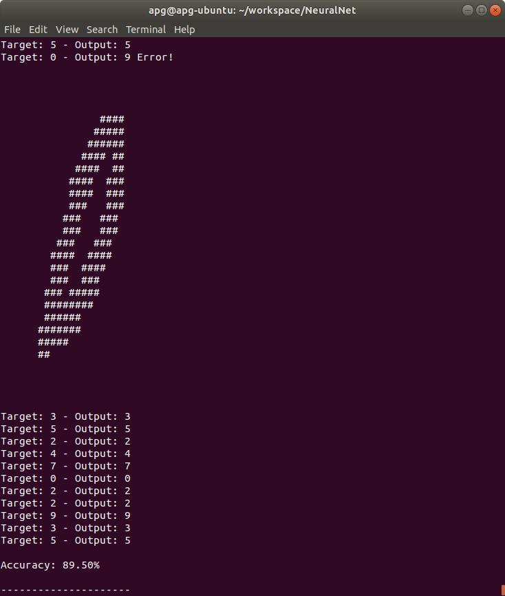
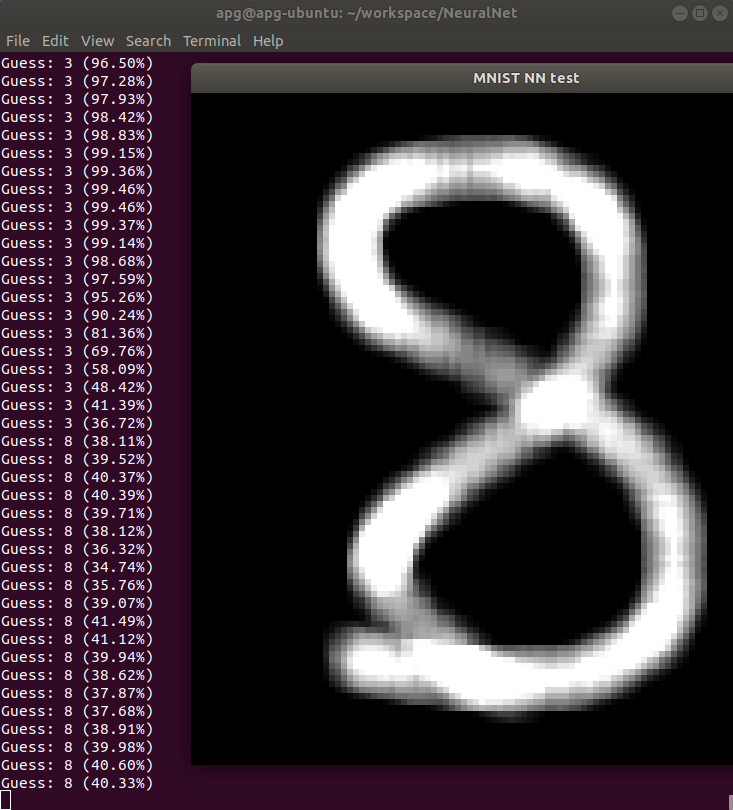

# Toy-Neural-Network

A standard [artificial neural network](https://en.wikipedia.org/wiki/Artificial_neural_network) implemented in C++11. There are two <i>main</i> files through which you can train / experiment with this NN:
1) main XOR.cpp: a simple implementation, hello-world style. It solves the XOR problem.
2) main MNIST.cpp: the NN is trained against the MNIST database and lets you check the final accuracy against a training set. Given enough inputs and the right parameters, this particular neural network can be pushed to ~96% accuracy.

  

Alternatively, you can choose to open a graphic window (SFML dependency) and use you mouse to draw a number, you'll see the neural network process the input as you draw.

  

Unfortunately this last method still shows the limitations of the network: a simple movement of the same drawing through arrow keys reveals how the correct interpretation of the input relies on its absolute position. Another problem can be encountered by drawing numbers that are significantly larger or smaller than their MNIST counterparts. This is due to the fact that the training database has undergone some considerable normalization of its numbers position and size, and because of this the NN gives wrong answers whenever the inputs are far enough from the "stimuli" it was trained on. Further improvements can be achieved through image preprocessing, as seen in convolutional neural networks.
